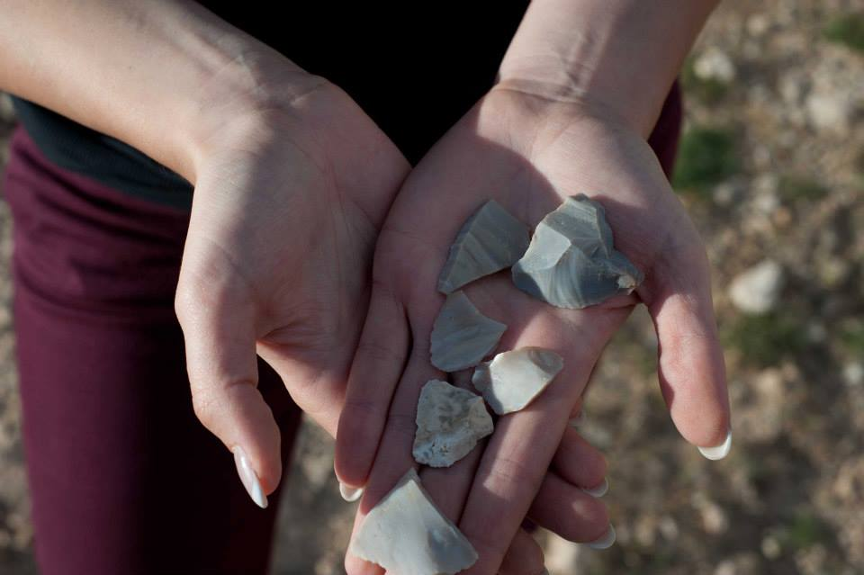

# Using pXRF to Determine Lithic Source Materials
> Research outcomes from 2012 archaeological excavation in Wemindji, Quebec. Stone tool flakes of multiple sources were found. pXRF laser technology was used to determine possible location-specific materials.

## Abstract

Understanding the source of raw materials used to make stone tools could be key to understand trade and migration patters in northern Quebec. New portable X-Ray Florescence (pXRF) technology has made the process of determining the chemical composition of lithics relatively inexpensive, fast, and possible to perform without destruction of the artifact. Using the pXRF data this paper will show that element correlation presented in the form of principal component analysis coupled with geographic observations can aid the process of sourcing lithic raw materials in Quebec in some cases.   

However, without a database of pXRF raw material source data, pXRF cannot definitively source materials in Quebec and archaeologists must continue to use visual analysis in tandem with the new technology to attempt to source raw materials.

## Meta

Alice Walker – [@atatwalker](https://twitter.com/aliceemmwalker)

 This work is licensed under a <a rel="license" href="http://creativecommons.org/licenses/by-nc-nd/4.0/">Creative Commons Attribution-NonCommercial-NoDerivatives 4.0 International License</a>.

[https://github.com/atatwalker/stat-analysis-with-spss](https://github.com/atatwalker)

[npm-image]: https://img.shields.io/npm/v/datadog-metrics.svg?style=flat-square
[npm-url]: https://npmjs.org/package/datadog-metrics
[npm-downloads]: https://img.shields.io/npm/dm/datadog-metrics.svg?style=flat-square

